# Torque Pro Assistant

<!--
  CI badge is parked while the repo is private — shields.io can only
  query workflow status on public repos (returns "REPO OR WORKFLOW NOT
  FOUND" otherwise). Re-enable the line below once the repo goes public.

[](https://github.com/iPzard/torque-pro-assistant/actions/workflows/ci.yml)
-->
[](LICENSE)

> Desktop log viewer for [Torque Pro](https://torque-bhp.com/) OBD-II driving sessions. Drop in a CSV export, explore the data with charts, and compare historic trips side-by-side.

<!-- Animated first-run mockup. Replace with a real screen capture once we have one. -->


## 🛠️ Setup

> These setup steps are for **developers** working on the app. End users who install a packaged build (MSI / DMG / DEB) need none of this — the installer ships everything.

### Prerequisites

| Tool | Recommended | Notes |
|---|---|---|
| [Node.js](https://nodejs.org/en/download/) | 20.x LTS | Required ≥ 18.18 (or ≥ 20.9 LTS). ESLint 9 enforces this. |
| [Yarn 1](https://classic.yarnpkg.com/) | 1.22.x | `npm install` works too, but the lockfile + scripts are tested against Yarn 1. |
| [Python](https://www.python.org/downloads/) | 3.10 – 3.12 | Used for the Flask service in dev and bundled by PyInstaller for production. |
| [pip](https://pip.pypa.io/) | bundled with Python | Use `pip`, `pip3`, or `py -m pip` — whichever your install exposes. |

**Platform-specific (only when packaging installers):**

- **Windows MSI:** [WiX Toolset 3.x](https://github.com/wixtoolset/wix3/releases) on `PATH` (e.g., `C:\Program Files (x86)\WiX Toolset v3.14.1\bin`).
- **Linux DEB:** `fakeroot` and `dpkg` on `PATH` (`sudo apt install fakeroot dpkg`).
- **macOS DMG:** no extra tools needed for an unsigned build. Code signing requires an Apple Developer ID.

### Install dependencies

Clone the repo and from the project root:

**Python deps** (Flask, flask-cors, PyInstaller, pytest):
```bash
pip install -r requirements.txt
```

**Node deps:**
```bash
yarn install
```

<br>

## ⚙️ Config

**Electron:** `main.ts` and `preload.ts` live at the project root. They compile to `dist-electron/` via `tsc -p tsconfig.electron.json` (run automatically by `yarn start` and `yarn build`).

**React:** Renderer code lives in `./src/`. The renderer root is `./src/components/app/`, which hosts the Mantine `AppShell` and the platform-aware window chrome — frameless on Windows / Linux with custom min/max/close controls inside the header, `titleBarStyle: 'hiddenInset'` on macOS so the OS renders the real traffic lights.

**UI:** [Mantine](https://mantine.dev/) (core, hooks, dates, notifications, dropzone). Theme is configured in the renderer entry point and defaults to dark mode.

**Charts & CSV:** [Recharts](https://recharts.org/) for plotting and [Papa Parse](https://www.papaparse.com/) for parsing the Torque Pro CSV exports — both installed but not yet wired into features.

**Python:** Backend lives in `./app.py`. The renderer reaches it over `http://127.0.0.1:<port>` — `main.ts` picks a free port in 3001–3999 and hands it to the renderer via the contextBridge `electronAPI.getPort()`. A `/ping` route is wired as proof of life; real Torque-Pro-specific routes will be added as features land.

<br>

## 📜 Scripts

The full list is in `package.json` under `scripts`. The everyday ones:

| ⚠️ &nbsp;PyInstaller is included in `requirements.txt`, so a separate install is no longer required. Installer metadata (name, version, manufacturer, description) is pulled from the matching fields in `package.json` automatically. |
| --- |

**Start developer mode** (React dev server + Electron + Flask, with hot reload):
```bash
yarn run start
```

**Package Windows: <sup>*1*</sup>**
```bash
yarn run build:package:windows
```

**Package macOS:**
```bash
yarn run build:package:mac
```

**Package Linux:**
```bash
yarn run build:package:linux
```

**Build documentation:**
```bash
yarn run build:docs
```

*<sup>1</sup>Windows uses [electron-wix-msi](https://github.com/felixrieseberg/electron-wix-msi); install WiX Toolset and add it to your environment variables.*
<br><br>

## ✅ Verify

Run before pushing — same chain CI runs.

**Full chain (lint → typecheck → jest → pytest → React build):**
```bash
yarn verify
```

**Individual steps:**
```bash
yarn lint        # ESLint 9 flat config (eslint.config.ts)
yarn typecheck   # tsc --noEmit across renderer / electron / scripts tsconfigs
yarn test        # CRA jest runner
yarn test:python # pytest against tests/test_app.py
```
<br>

## 🐱‍👓 Docs

Code documentation, generated with [TypeDoc](https://typedoc.org/), is built into `./docs/` via `yarn run build:docs`.
<br><br>

## 🦟 Bugs

Bugs reported on the project's [issues page](https://github.com/iPzard/torque-pro-assistant/issues) will be exterminated as quickly as possible, be sure to include steps to reproduce so they can be spotted easily.
<br><br>

## 🏷️ License

MIT © [iPzard](LICENSE)
